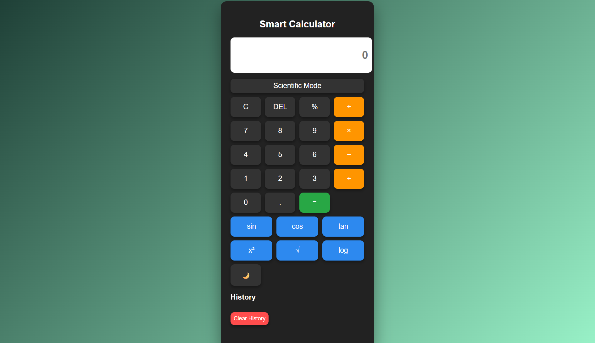

# 🧮 Smart Calculator Pro

A **modern Scientific Calculator Web Application** built using **HTML, CSS, and JavaScript**.

This project demonstrates strong **frontend development skills**, including UI design, DOM manipulation, keyboard event handling, and mathematical operations.

---

## 🚀 Features

✔ Basic Calculator Operations (**+, −, ×, ÷**)
✔ Scientific Calculator Mode
✔ Keyboard Input Support
✔ Calculation History Tracking
✔ Clear History Option
✔ Dark / Light Theme Toggle
✔ Animated UI Buttons
✔ Responsive Design (Works on Mobile & Desktop)
<<<<<<< HEAD
✔ History + Memory
✔ 📲 Installable PWA App 🔥
✔ Live Demo 🌐
✔ Screenshot 📸
=======
🎤 Voice Calculator

Perform calculations using voice commands like:
"five plus three", "10 divided by 2", etc.
>>>>>>> 90fbc32 (Adding voice response)

---

## 🛠️ Technologies Used

* **HTML5** – Structure of the application
* **CSS3** – Styling and responsive UI design
* **JavaScript (ES6)** – Logic, calculations, and event handling

---

## 📸 Project Screenshot



---

## ▶️ How to Run the Project

1. Clone the repository

```
git clone https://github.com/Shuvankar01/Smart-Calculator.git
```

2. Open the project folder

3. Run **index.html** in any browser
4. ## 📲 Installable App (PWA)

This project is built as a Progressive Web App (PWA), allowing users to install it directly on their device.

👉 Simply click the **Install App icon** in the browser address bar to add it to your desktop or mobile.

✨ Once installed, it works like a native application with offline support.

---

## 🎯 Learning Objectives

This project helped me understand:

* DOM Manipulation
* Event Listeners
* JavaScript Math Functions
* Responsive UI Design
* Interactive Web Applications

---

## 📌 Future Improvements

* Save calculation history using **LocalStorage**
* Add **Advanced Scientific Functions**

---

## 👨‍💻 Author

**Shuvankar Sahoo**

🎓 B.Tech Computer Science Student
💻 Aspiring Backend Developer
🤖 AI & Machine Learning Enthusiast

---

⭐ If you like this project, consider giving it a **star on GitHub!**
